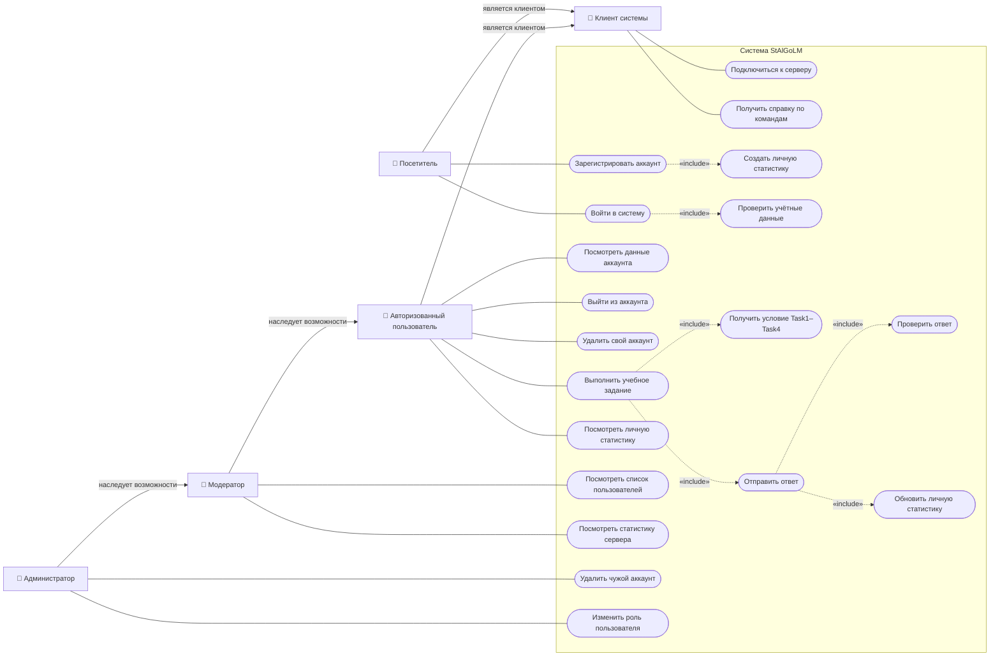

# Use Case: варианты использования StAlGoLM

Диаграмма построена по фактически реализованным командам сервера и возможностям оконного клиента.

## Акторы

| Актор | Возможности |
|---|---|
| Клиент системы | Подключение к серверу и получение справки |
| Посетитель | Регистрация и авторизация |
| Авторизованный пользователь | Работа со своим аккаунтом, выполнение заданий и просмотр личной статистики |
| Модератор | Все возможности пользователя, список пользователей и общая статистика сервера |
| Администратор | Все возможности модератора, удаление чужих аккаунтов и изменение ролей |

Стрелка `наследует возможности` между акторами означает, что более привилегированная роль также может выполнять варианты использования нижестоящей роли. Например, администратор может делать всё, что доступно модератору и обычному пользователю.

## Основной сценарий выполнения задания

1. Пользователь авторизуется.
2. Выбирает тип задания `Task1`–`Task4` и номер шаблона.
3. Система генерирует условие и сохраняет правильный ответ в текущей пользовательской сессии.
4. Пользователь отправляет ответ.
5. Система проверяет его и изменяет соответствующую ячейку статистики: `+1` за правильный ответ или `−1` за неправильный.
6. Пользователь при необходимости просматривает накопленную личную статистику.

Связь `«include»` показывает обязательную часть более крупного варианта использования. Например, выполнение задания обязательно включает получение условия и отправку ответа, а отправка ответа — его проверку и обновление статистики.

## Соответствие командам сервера

| Вариант использования | Команда |
|---|---|
| Зарегистрировать аккаунт | `reg login password email [role]` |
| Войти в систему | `auth login password` |
| Выйти из аккаунта | `logout` |
| Посмотреть данные аккаунта | `whoami` |
| Удалить свой или чужой аккаунт | `del [login]` |
| Изменить роль пользователя | `role login newRole` |
| Посмотреть пользователей | `users` |
| Посмотреть статистику сервера | `stats` |
| Получить задание | `task1`–`task4` с номером шаблона |
| Отправить ответ | Число после получения задания |
| Посмотреть личную статистику | `mystats [1-4]` |
| Получить справку | `help` |

## Важные особенности текущей реализации

- Оконный Qt-клиент предоставляет кнопки для регистрации, входа, выхода, просмотра профиля, получения заданий, отправки ответов и личной статистики.
- Команды модератора и администратора реализованы на сервере, но отдельных кнопок для них в оконном клиенте нет. Их можно вызвать через текстовый TCP-клиент, например PuTTY в режиме Raw.
- Серверная команда регистрации технически принимает необязательную роль, включая `moderator` и `admin`, хотя оконный клиент этот параметр не отправляет. Для реальной системы выдачу привилегированных ролей при публичной регистрации следовало бы запретить.
- `Task1`–`Task4` объединены на диаграмме в один вариант использования, потому что их пользовательский сценарий одинаков: получить условие, отправить ответ и обновить статистику.

Редактируемый исходник Mermaid

Отдельный исходник диаграммы для редактирования и экспорта находится в `documentation/use-case/use-case-diagram.mmd`.
