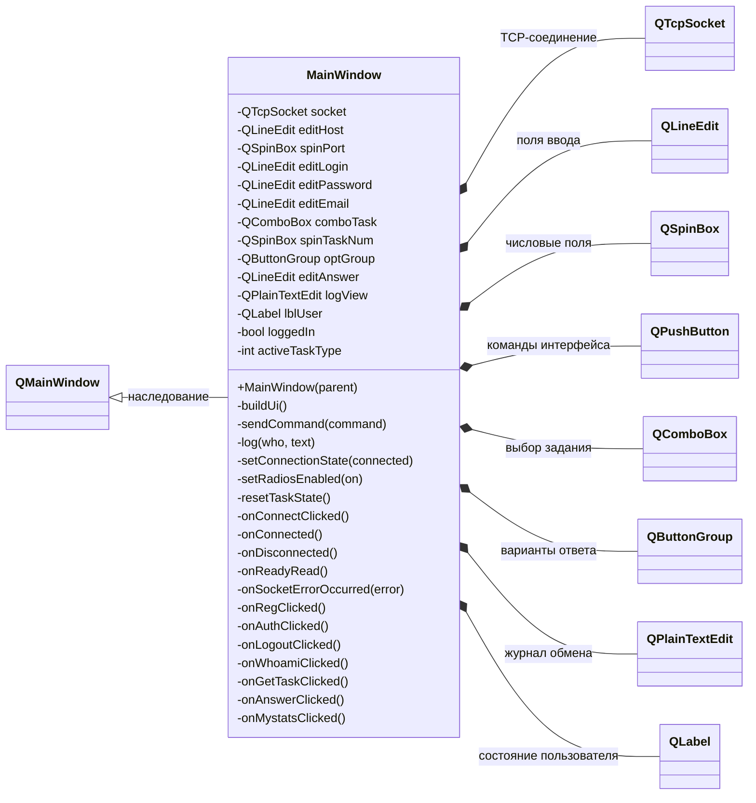
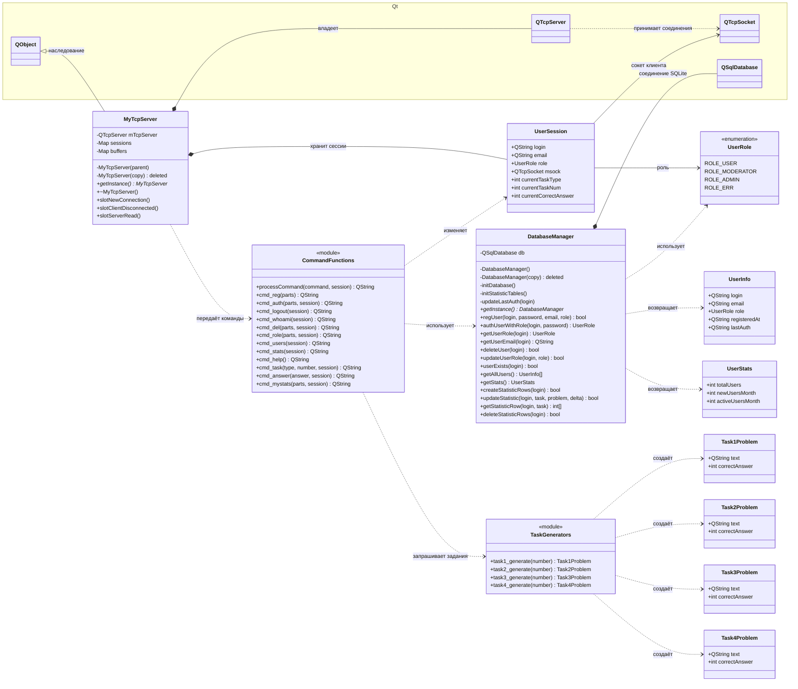

# Диаграммы классов клиента и сервера

Диаграммы построены по текущему исходному коду проекта. Добавлять новые классы для их создания не требуется: диаграмма описывает уже существующую архитектуру.

Обозначения связей:

- `A <|-- B` — класс `B` наследуется от `A`;
- `A *-- B` — композиция: объект `A` владеет объектом или набором объектов `B`;
- `A --> B` — направленная ассоциация;
- `A ..> B` — зависимость: `A` использует `B`.

## Клиент

В клиентской части собственный класс проекта один — `MainWindow`. Он наследуется от `QMainWindow`, создаёт TCP-сокет и элементы интерфейса Qt. Через сокет окно отправляет текстовые команды серверу и получает ответы.

Исходник Mermaid диаграммы клиента

## Сервер

Серверная часть разделена на приём TCP-соединений, хранение состояния сессии, разбор команд, работу с базой данных и генерацию заданий. `MyTcpServer` и `DatabaseManager` реализованы как одиночки: получить их экземпляры можно через `getInstance()`, а копирование запрещено.

`CommandFunctions` и `TaskGenerators` на диаграмме отмечены стереотипом `module`. Это не классы C++, а логические группы свободных функций из файлов `server_functions.*` и `task1.*`–`task4.*`. Такое обозначение позволяет показать важные зависимости, не выдавая функции за реально существующие классы.

Исходник Mermaid диаграммы сервера

## Что видно из диаграмм

- Клиент отвечает только за интерфейс и обмен командами по TCP; вычисления заданий и работа с базой находятся на сервере.
- Сервер хранит отдельную `UserSession` для каждого подключённого клиента.
- Разбор команд связывает сетевой слой с базой данных и генераторами четырёх типов заданий.
- Реализованный вариант № 3 не добавляет новый класс: он использует существующую структуру `Task3Problem` и функцию `task3_generate()`.

Отдельные исходники Mermaid для экспорта находятся в каталоге `documentation/class-diagrams`.
