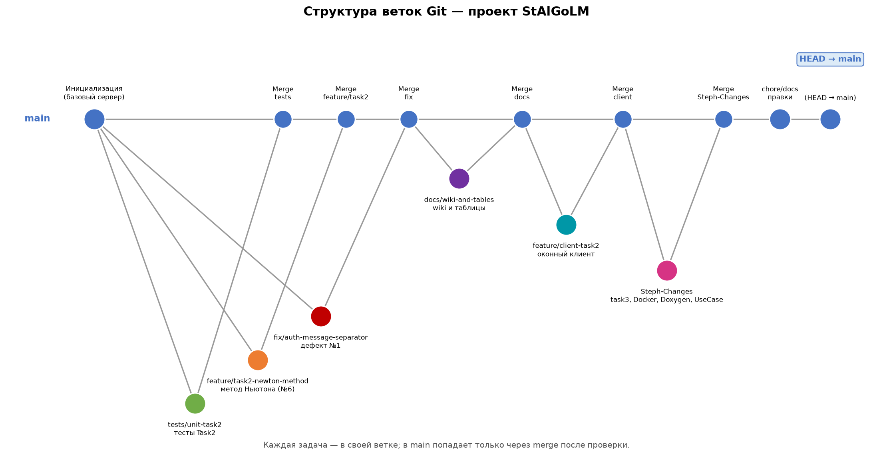

# Структура Git

## Зачем ветки в этом проекте

Работа над проектом идёт небольшими независимыми задачами (задание по варианту, исправление дефекта, тесты, документация). Каждая задача делается в **отдельной ветке**, а в `main` попадает только через **merge** после проверки. Так `main` всегда содержит рабочую версию: сервер в любой точке истории `main` собирается и проходит тесты.

## Схема ветвления



## Ветки проекта

| Ветка | Автор | Назначение | Что попало в main |
|---|---|---|---|
| `main` | — | Основная линия развития. Только рабочие, проверенные версии | — |
| `feature/task2-newton-method` | Голь | Задание по варианту №6: генератор «метод Ньютона» вместо заглушки task2 | 10 шаблонов функций, 4 варианта ответа, обновлённый help |
| `fix/auth-message-separator` | Голь | Исправление дефекта №1 (верный пароль отклонялся из-за байта-разделителя) | новый разбор сообщений в `mytcpserver.cpp`, буфер `mBuffers` |
| `tests/unit-task2` | Голь | Модульные тесты (QtTest) для математики task2 | `tests/tst_task2_test.cpp`: 4 теста, 400 генераций |
| `docs/wiki-and-tables` | Голь | Wiki проекта и таблицы тестирования | `wiki/`, `таблицы/` |
| `feature/client-task2` | Голь | Оконный клиент (Qt Widgets) | `client/`: подключение, аккаунты, задания, ответы |
| `Steph-Changes` | Степан | Task3 — метод половинного деления (вариант №3) + Docker + Doxygen + UseCase/диаграммы | `task3.cpp/.h`, `Dockerfile`, `compose.yaml`, `documentation/`, тесты Task3 |

## История коммитов (как получилось на самом деле)

```
* db38069 docs: wiki после слияния — команда из трёх человек, страница Task3, протокол и архитектура под task3
* 02a8939 docs: актуализирован тест-кейс Task2 (лист переименован Task5 -> Task2)
* 4f386d6 chore: убрать lock-файлы LibreOffice из репозитория и игнорировать их
*   a774144 Merge branch 'Steph-Changes' в main: task3 (метод половинного деления), Docker, Doxygen, тесты task3
|\  
| * cb5df34 Add Task3, documentation, Docker and tests
|/  
* 4e1c592 chore: игнорировать временные файлы Excel (~$*)
*   dc21866 Merge branch 'feature/client-task2' в main: оконный клиент
|\  
| * 8d27a1d feat: оконный клиент для сервера (Qt Widgets)
|/  
* 1d60bef chore: исключить личные памятки из репозитория
* 0276953 docs: страница «Структура Git» — схема ветвления и описание модели
*   8739bf6 Merge branch 'docs/wiki-and-tables' в main
|\  
| * b804a35 docs: Wiki проекта и таблицы тестирования
|/  
*   4c807d4 Merge branch 'fix/auth-message-separator' в main: исправление дефекта №1
|\  
| * 2ced5f8 fix: разделитель сообщения 0x01 ищется внутри пакета (дефект №1)
* |   b470144 Merge branch 'feature/task2-newton-method' в main: задание по варианту №6
|\ \  
| * | 7abcb67 feat: task2 переведён на метод Ньютона (вариант №6 из списка)
| |/  
* |   6eff2af Merge branch 'tests/unit-task2' в main: модульные тесты task2
|\ \  
| |/  
|/|   
| * f4b2458 test: модульные тесты для task2 (метод Ньютона)
|/  
* 5c11172 Инициализация: TCP-сервер с аккаунтами, ролями и заданиями
```

## Рабочий цикл (как делалась каждая задача)

```
git checkout main                  # стартуем от рабочей версии
git checkout -b имя-ветки          # новая ветка под задачу
# ... правки, коммиты ...
git push -u origin имя-ветки       # опубликовать ветку (как делал Степан)
git checkout main
git merge --no-ff имя-ветки        # влить задачу в main отдельным merge-коммитом
git push                           # обновить сервер
```

`--no-ff` (no fast-forward) заставляет git создать отдельный merge-коммит, даже если можно было бы «просто прокрутить» main вперёд — так в истории видно, где вливалась каждая задача, и схема ветвления читается как на картинке выше.

## Как выглядит репозиторий

- Игнорируемое (`.gitignore`): папки сборки `build*/`, `*.o`, локальная база `server.db`, файлы Qt Creator (`*.pro.user`), временные файлы Office (`~$*`, `.~lock.*#`).
- Файл `README.md` — краткое описание и сборка.
- Коммиты на русском, в формате `тип: суть` (feat / fix / test / docs / chore) — по типу коммита сразу видно, что это было.
